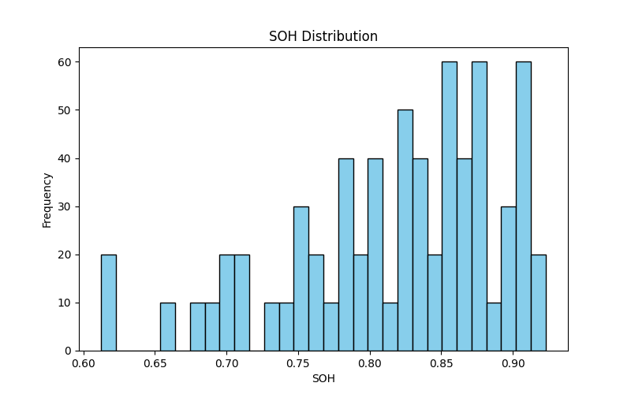
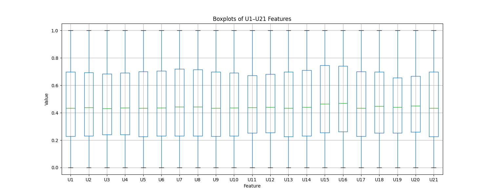
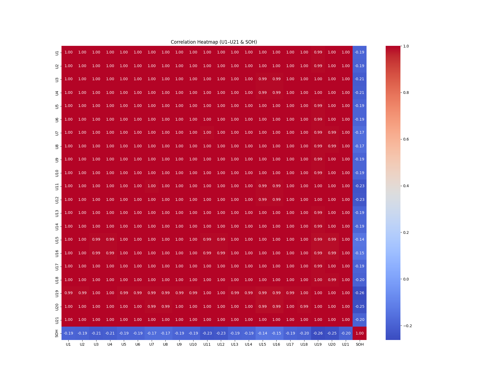

# Section: Visualize SOH Distribution and Correlations
Prepared by: Mohit Gajula

### 1. Introduction

This analysis investigates the State of Health (SOH) distribution and major feature correlations in the PulseBat dataset. The aim is to help identify patterns supporting prediction of battery health and guide model selection for downstream tasks.

### 2. SOH Histogram

Figure 1: SOH Distribution Histogram

H values are clustered toward higher values (most above 0.75, many between 0.80 to 0.92).

- Suggests the dataset mainly contains batteries in “good” condition.

### 3. U1–U21 Boxplots

Figure 2: Boxplots of U1–U21 Features

1–U21 voltage features show similar distribution, consistent median and spread.

- Some slight outliers indicate rare odd readings; data is generally stable.

### 4. SOH Correlation Heatmap

Figure 3: Correlation Heatmap (U1–U21 & SOH)

- All U features correlate negatively with SOH (range: ~-0.14 to -0.26).

- Strongest negative correlations: U14, U20, U21.

- U features are highly correlated with each other (values near 1.0).

### 5. Conclusions

- Majority of batteries are healthy based on SOH.

- Feature ranges are uniform and reliable, supporting modeling.

- SOH has moderate negative correlations with all cell voltage features, especially U14, U20, U21.

- Code and all outputs are reproducible with the files in this folder.

### How to Reproduce:

Run soh_visual_analysis.py in this folder (or convert to a Jupyter notebook for stepwise output).

Make sure your data source path is set to "notebooks/cleaned_pulsebat.csv".

